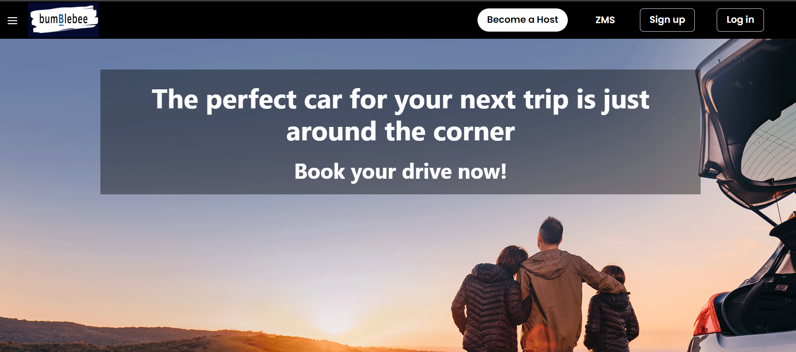
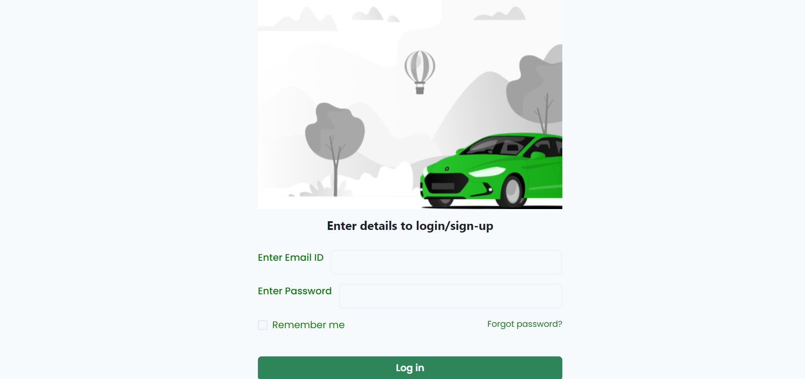
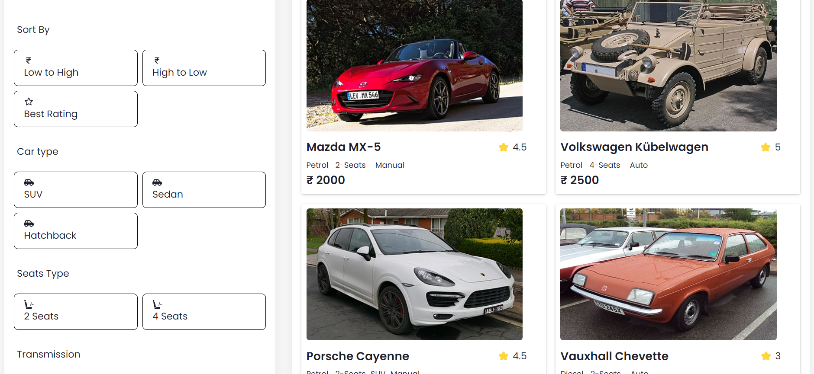
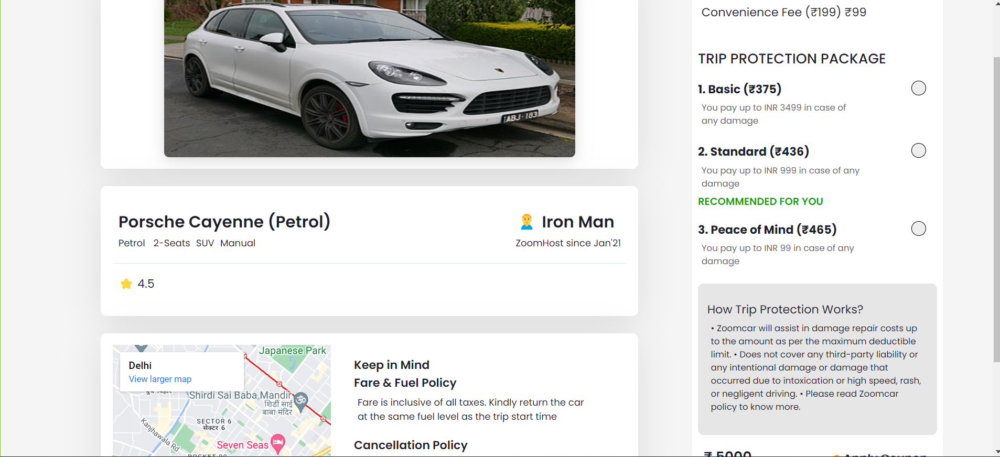
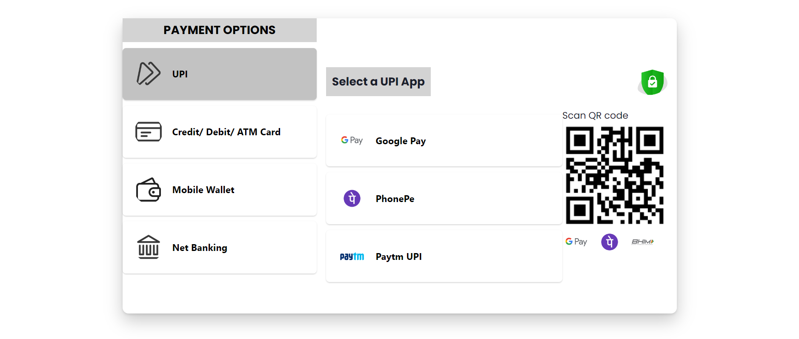
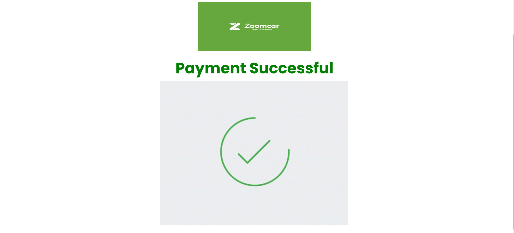

## Working on Zoomcar clone....

<h1>Landing Page</h1>
 

 

<h1>Login Page</h1>
 

 
<h1>Cars Page</h1>
 

 

<h1>Single Car Page</h1>
 

 

<h1>Payment Page</h1>
 

 

<h1>Payment Successful Page</h1>
 

 

Tasks for all Team mate

<b>Suneet</b> - Navabr, sidebar, Landingpage,HostPage,DatePage,Routing
 
<b>Papri</b> - SignupPage, LoginPage,Responsiveness,Routing
 
<b>Nitin</b> - Cars Page (sorting and filter functionality),SingleCarPage
Process to pay page - This page is Private Page Means Protected without login can't access,
LocationPage,Routing
 
<b>Jyoti</b> - Payment page, Process to pay page with location thing,Routing
 
 
 
<h3>Thank You 🙂
